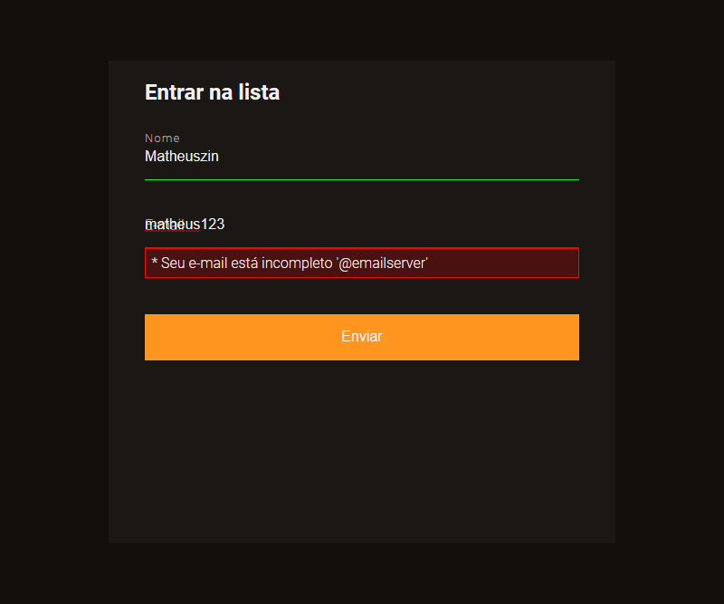

<h1 align="center"> Validadando Formulário </h1>

Validando um formulário com HTML, CSS e JavaScript.

  <a href="#-tecnologias">Tecnologias</a>&nbsp;&nbsp;&nbsp;|&nbsp;&nbsp;&nbsp;
  <a href="#-projeto">Projeto</a>&nbsp;&nbsp;&nbsp;|&nbsp;&nbsp;&nbsp;
  <a href="#-contato">Contato</a>

  

 

  

## 🚀 Tecnologias

Esse projeto foi desenvolvido com as seguintes tecnologias:

- HTML
- CSS
- JavaScript DOM

## 💻 Projeto

Esse projeto foi desenvolvido por conta desse [vídeo](https://www.youtube.com/watch?v=GTMEuHxh8aQ) da [Rocketseat](https://www.rocketseat.com.br/).

Dê uma olhada no projeto clicando nesse [link](https://matheusfdosan.github.io/validadando-formulario/).

## Contato

- Acesse também meus outros repositórios no [Github](https://github.com/matheusfdosan?tab=repositories).

- Também me siga no [Instagram](https://instagram.com/matheusfdosan).
